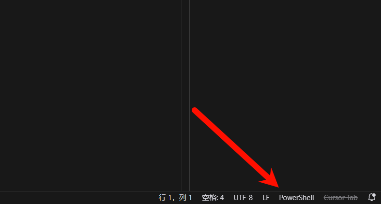
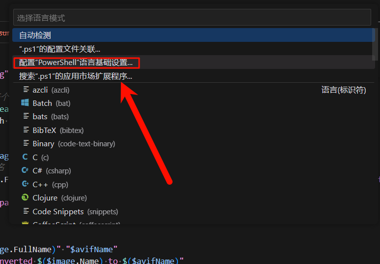
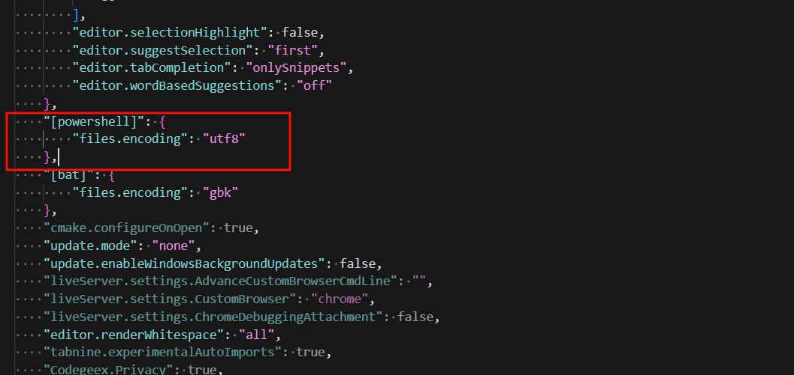

## 使用说明

Win 10自带的powershell不支持utf8的中文输出（会变成乱码）。  

> 自带的支持GBK。  

编者使用powershell 7作为日常的shell环境，其支持utf8脚本的中文输出。  

https://www.cnblogs.com/ABuSiDeLuoYin/p/18083425  


在powershell中，执行如下命令可以查看到当前的powershell版本，6.0以上支持UTF8。  

```pwsh
$PSVersionTable.PSVersion
```


```
Major  Minor  Patch  PreReleaseLabel BuildLabel
-----  -----  -----  --------------- ----------
7      4      5
```

这个输出，表示是7.4.5版本。  

### 安装pwsh

pwsh就是powershell。  

```powershell
winget install pwsh
```


或者，打开github，下载并安装

https://github.com/PowerShell/PowerShell/releases  


## 开发配置

### 编码配置

cursor或者vscode中，似乎默认gbk打开ps1文件，因此我们需要更改默认配置。  









```json
    "[powershell]": {
        "files.encoding": "utf8"
    },
```

