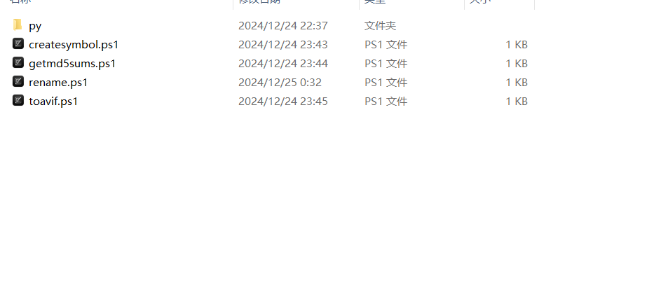
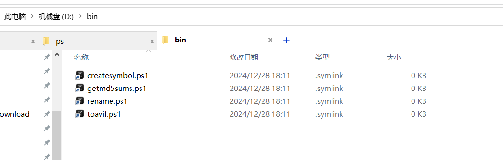

# createsymbol
很多时候我们只是想要创建同名的软连接，但是为此不得不输入两个超长的路径。  
这条命令可以批量生成软连接到另一个目录。  

## 使用
```ps1
# 进入到工作目录
cd xx/bin
# 指定目标目录，即最终存放软连接的目录（一般为空目录），你甚至无需创建该目录
createsymbol D:/bin
```

## 示例
这是当前目录，我现在需要为这四个文件创建软连接（会忽略文件夹）

打开powershell
```ps1
cd C:\Users\acer\bin\ps\scripts
createsymbol D:/bin
```
可以看到，D盘的bin文件里面出现了软连接。  

